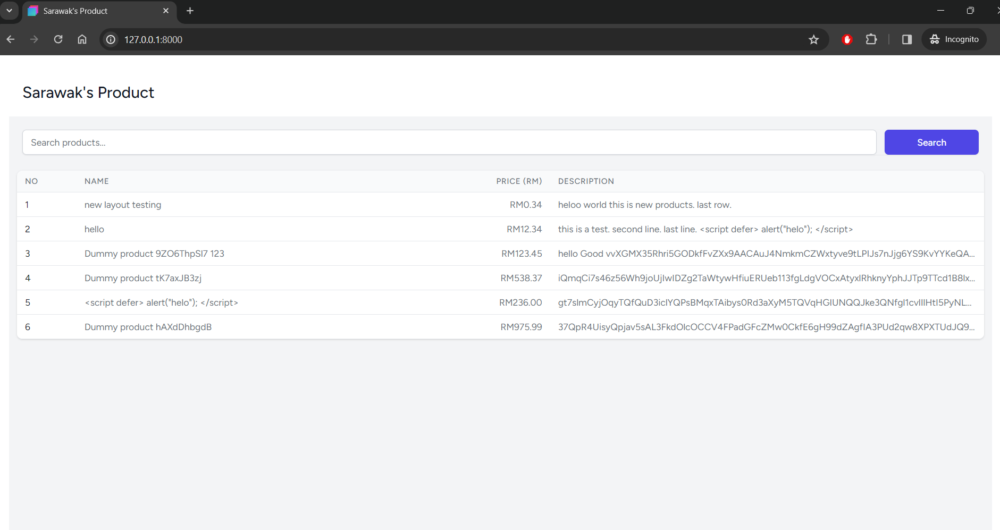
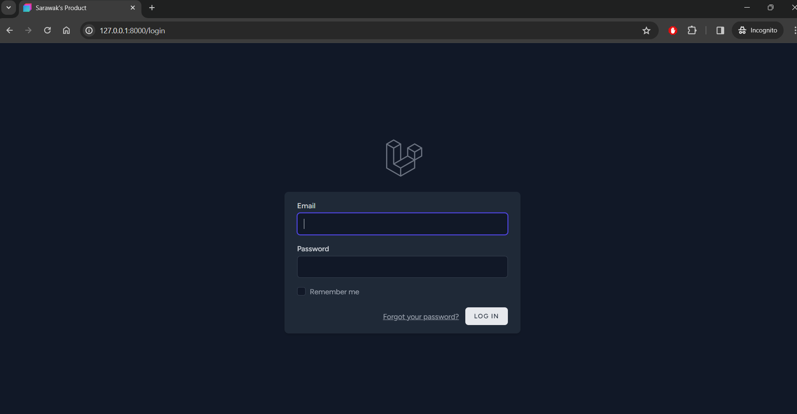
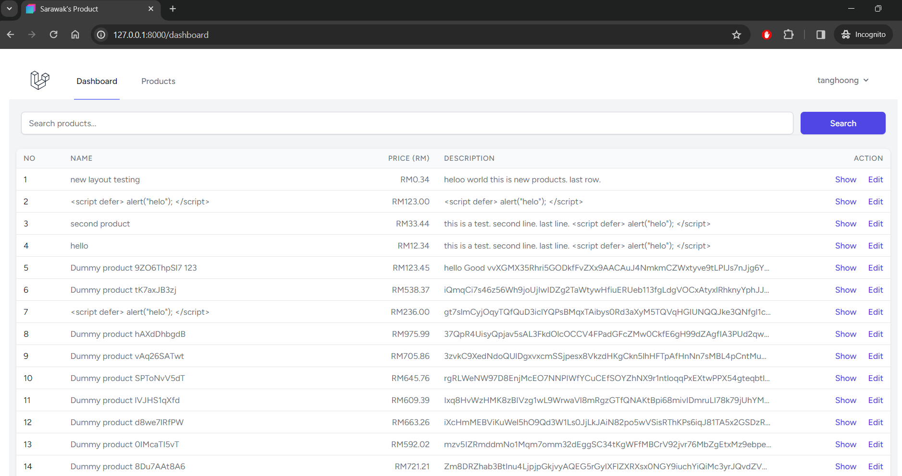
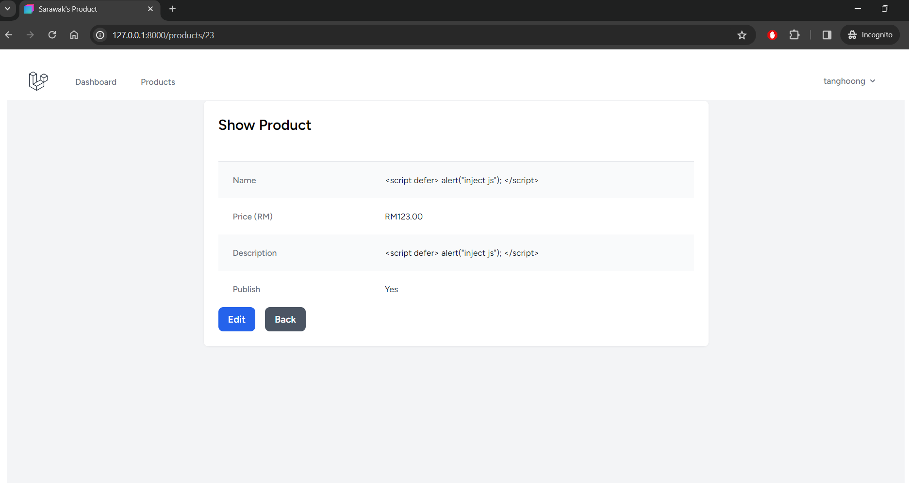
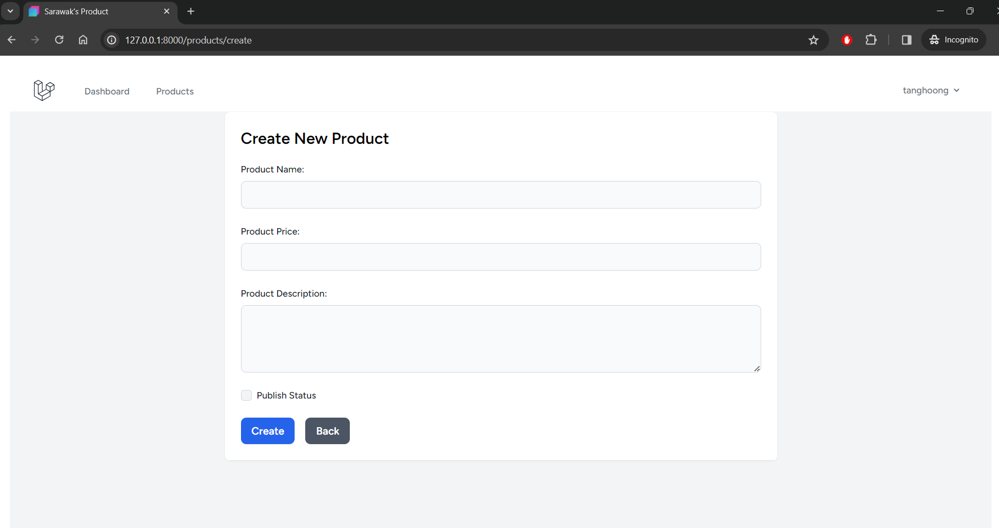
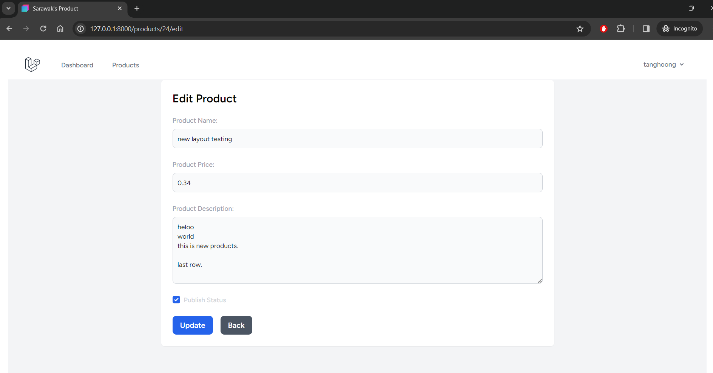
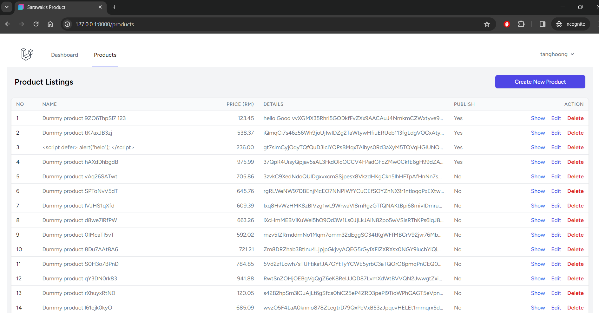
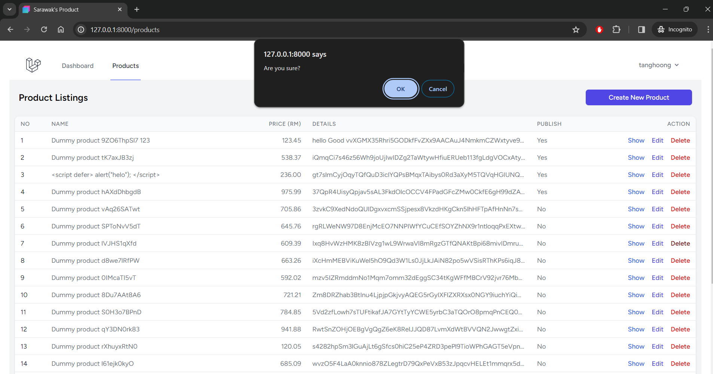

## Product Price Tracker

This is a simple web project that tracks the price of products in Sarawak. It's meant as a demo site, which for practicing the latest laravel 11.0.0 and PHP 8.1.0.

Extimate taken around 1 hours for setup the draft project, and another 4 hours for the optimization.

## Features include:

- [x] Able to track the price of products
- [x] Public search the published products
- [x] Login and register to admin dashboard
- [x] Admin can add, edit, delete products
- [x] Admin can view the list of products

## Routes:
[Front page](http://127.0.0.1:8000)
[Login page](http://127.0.0.1:8000/login)
[Register page](http://127.0.0.1:8000/register)
[Admin dashboard](http://127.0.0.1:8000/dashboard)
[Admin view products](http://127.0.0.1:8000/products)
[Admin add products](http://127.0.0.1:8000/products/create)
[Admin view single product](http://127.0.0.1:8000/products/{id})
[Admin edit products](http://127.0.0.1:8000/products/{id}/edit)

## Screenshot

### Public Search

### Login

### Admin Dashboard

### Admin View Product

### Admin Add Product

### Admin Edit Product

### Admin List Product

### Admin Delete Product

###### EOF

